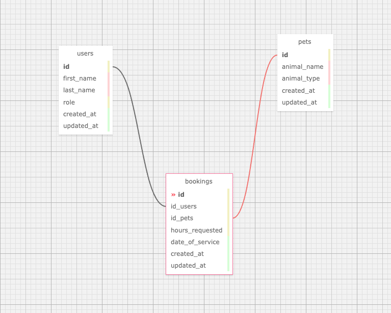
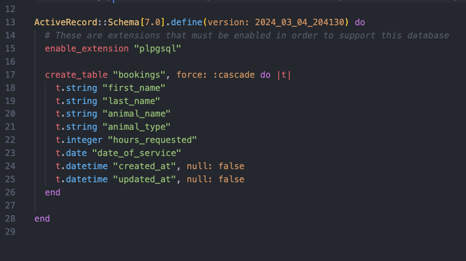
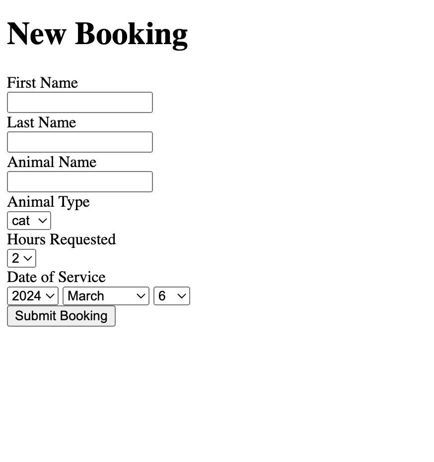
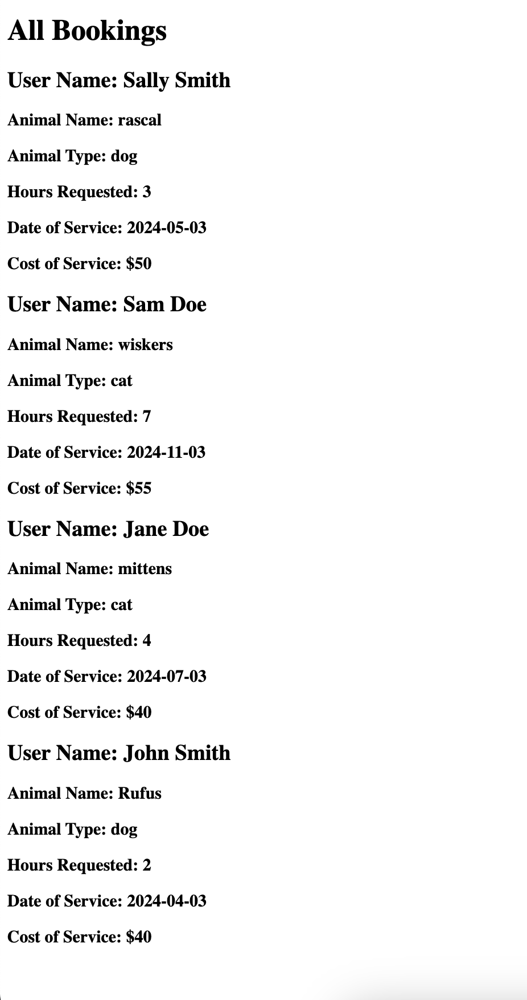

# Justin Mauldin's Rails Assessment:
My Rails implementation successfully accomplishes the requirements set forth in the below instructions provided to me.


## Prompt
LoadUp is rolling out a new service, cat and dog sitting. The product requirements are as follows:

1. A form to collect bookings that takes:
    * a. First Name
    * b. Last Name
    * c. Animal Name
    * d. Animal Type (Dog/Cat)
    * e. Hours Requested (min 2, max 8)
    * f. Date of service
 
2. A "pricing engine" to determine the cost of service:
    * a. Base charge of $20
    * b. $10 additional per hour for dogs
    * c. $5 additional per hour for cats
 
3. Display of all bookings on a separate page ("admin" pages).
4. Unit tests for the pricing engine.
5. E2E (feature) tests for the booking form and admin pages.


## Developer Notes
### My Approach & Thought process:
I used Test Driven Development in order to create this whole implementation.  

Where I thought requirements were vague or nonexistent, I made executive decisions about the implementation & context, instead of getting stuck in analysis paralysis. I am prepared to instead explain the reasoning for the decisions & patterns I made in any follow up discussions with the hiring team.


### My Implementation Choices:
Below are a few key things that I want to call out & explain my implementation decisions on.

  * __DB Schema:__ 

    Because of the simple scope of this exercise, the short time-frame for implementation, & the specific fields that were outlined to be showing on the form that will create a booking, I went with a single "bookings" table in the database for my implementation.

    If we were thinking ahead just a bit about how this app might grow in the near future and what might be a better database design decision given more time, I would have reached for a separate "users" table & separate "pets" table with a joins between the two of the "bookings" table.
    
    I would have advocated for & worked with the product-owner to come to a working agreement for a slightly different interaction pattern on the form so that we could accommodate this more ideal database architecture without compromising any functionality for the end user.

 * __Booking Creation Flow:__
      
    Because there was no details in the prompt that once a user creates a booking, that they need to see the show page for that booking, I made the executive decision since the requirements were vague to just redirect the user back to the booking new page after the record was created & have a flash message alerting the user that the record was either created successfully, or encountered an error and was not created.

    I know a standard interaction pattern for apps is to display a show page for the record that was just created, after that record is successfully created.  However, implementing it this way allowed me to create fewer resources and tests and sped up my implementation, while hitting the desired functionality that was outlined in the prompt.

    If we were in a normal dev team setting, this would have been something I would have asked the product-owner about and get clarification on before I started my implementation.

 * __Bookings Order on Admin Bookings Index Page:__
      
    If you look at my "index" method in the Admin::BookingsController, you will see I am doing an ActiveRecord query for all booking records, but ordering them in descending order.

    I very deliberately made the decision to order the records this way so that it is more apparent visually that a new record was added to the page, instead of having to scroll all the way down to the bottom of the page to see the last record created.

    I did this to help me verify more quickly the last record I created locally while implementing these new features.  If I had more time, I would have probably reached for implementing pagination with pages of records instead.

    This would also be another thing that I would bring up with the product-owner and most likely would be something that would be added to our backlog for future improvements & features to be prioritized & added in the future. 


### Things to add/refactor:
If given more time, below are the things I would add or change to my current implementation.

  * __Authentication & Authorization:__ 
  
    Based on the requirements from the prompt, the natural next step in the implementation of this "pet sitting" app is to add authentication & authorization.

    We would want users & admins to login to an account that they create in the system to see their personal bookings for their pets or the bookings their location has received.

    And since there is the idea of regular users & admins, we would need to authorize them to see certain pages/resources and not others.

    Currently, in my implementation, I am just utilizing namespacing to distinguish between my "booking new" & "admin bookings index" pages.

  * __DB Schema:__ 
  
    As mentioned in the "My Implementation Choices:" section above, if given more time, I would have reached for a better & more complex database architecture to better set us up for the future growth of this product.

    As shown in the image below, I would create a separate "users" table & separate "pets" table with a joins between the two of the "bookings" table.

    Also, on the users table, I would add a new field called "role" where we can handle the authorization of what pages to show & not show a user vs. an admin in the app.

    

  * __CSS/Styling:__ 
  
    I had as a stretch goal of mine to implement a more visually appealing styling of my pages using my CSS skills & knowledge.

    However, I ran out of time & the prompt did not indicate anything about adding styling, so I decided to stop my implementation once I hit all of the requirements in the prompt & focus on finishing things up with a detailed README.

    If I had more time, I would have used SASS variables to make things like colors, standard font sizes & spacing easier to change with custom styling.  Also, I would have created mixins and utilized media queries to ensure that the page was mobile responsive.

## Getting Started
These instructions will get you a copy of the project up and running on your local machine for development and testing purposes.

* ### Prerequisites:
  * Install Ruby (Version 3.2.2)
  * Install Rails (Version 7.0.5)
  * Install PostgreSQL (Version 14.11)
  * Install Bundler (Version 2.4.10)

* ### Installing:
  To run this application locally, clone the [scheduled_ride_service_app](https://github.com/justinmauldin7/scheduled_ride_service_app) repo and follow the steps below:

  * #### Install gems:
    ```
    $ bundle install
    ```

  * #### Create, migrate, & seed the database:
    ```
    $ rake db:setup
    ```

  * #### Start your Rails server:
    ```
    $ rails s
    ```

  * #### Open browser and navigate to:
    ```
    localhost:3000
    ```

## Database Schema
There is currently just one "bookings" table in the database.




## Views
Below is a comprehensive list of all the views/pages that are currently exposed by the pet sitting Rails app.

* ### Create a Booking as an User:
  This page has a form on it that allows you to create a new booking record in the database. 
  ``` 
  http://localhost:3000/bookings/new
  ``` 
   

* ### See All Bookings as an Admin:
  This page lists all the booking records in the database and displays them with the most recently created booking showing first.  
  ``` 
  http://localhost:3000/admin/bookings
  ```  
  


## Testing
This app was developed using TDD via Rspec & Capybara tests.  The app is fully tested end-to-end with unit & feature tests with all tests passing.

Unit tests were created using [RSpec](http://rspec.info/documentation/), with controller tests utilizing [Rails::Controller::Testing](https://github.com/rails/rails-controller-testing), & feature tests utilizing [Capybara](https://github.com/teamcapybara/capybara) & [Orderly](https://github.com/jmondo/orderly).

* ### Running the Full Test Suite:
  From the root of the directory, type the below command to run the full test suite:

  ```
  $ rspec
  ```

* ### Running a Single Test File:
  Type this command from the root of the directory.

  ```
  $ rspec ./spec/models/booking_spec.rb

  ```

* ### Running a Single Test From a Single Test File:
  Type this command from the root of the directory.

  *(Just change the line number in the command to run a different test in that file.)*

  ```
  $ rspec ./spec/models/booking_spec.rb:35
  ```


## Built With
* [Ruby - Version 3.2.2](https://ruby-doc.org/3.2.2/) - Base code language
* [Rails - Version 7.0.5](https://guides.rubyonrails.org/v7.0/) - Web framework used
* [PostgreSQL](https://www.postgresql.org/) - Database used

* [RSpec](http://rspec.info/documentation/) - Testing suite
* [Capybara](https://github.com/teamcapybara/capybara) - Feature testing
* [Rails::Controller::Testing](https://github.com/rails/rails-controller-testing) - Controller testing
* [Orderly](https://github.com/jmondo/orderly) - UI element order/placement on page testing 
* [Pry](https://github.com/pry/pry) - Debugging tool
